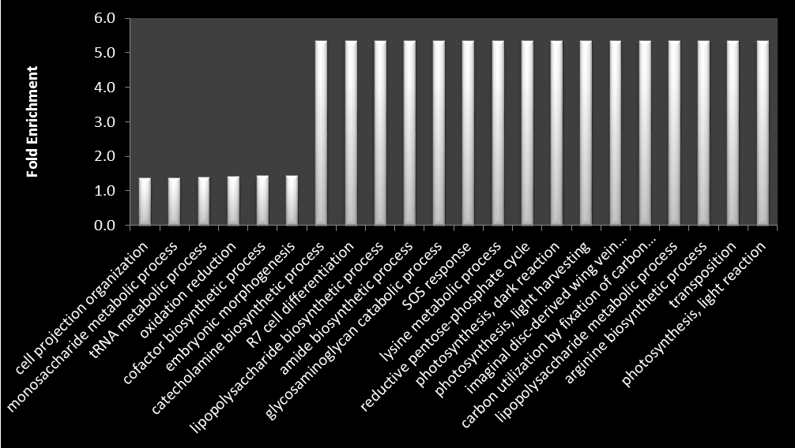

___
 
 
 
___
##Lowest and highest Fold enrichment values in biological process 

	Fold enrichment is a general statistical term that means how many fold more did something happen than you would expect by random chance, that is a fold enrichment of 2 means it happened twice as much as your random expectation.

##

##% values for those process

	% is the number of genes involved in given term is divided by the total number of user's input genes, i.e., percentage of user's input gene hitting a given term. For example, 10% of user's genes hit 'kinase activity'
##